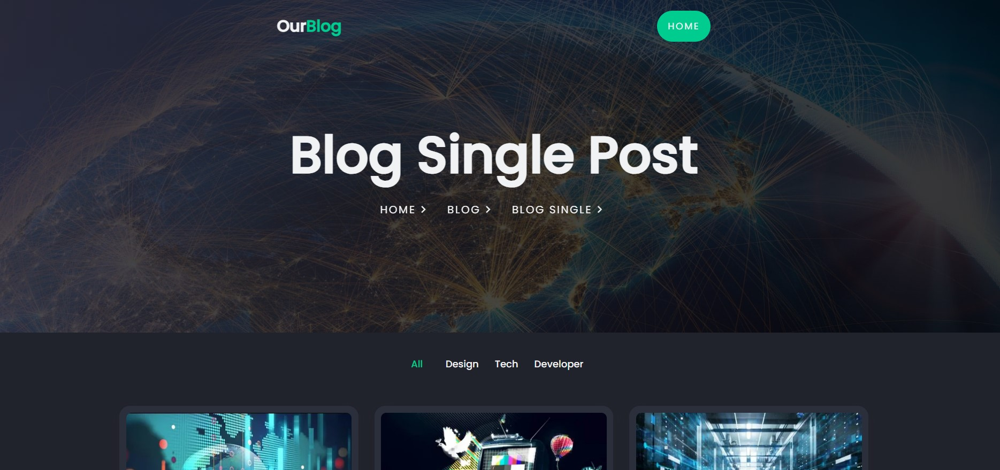

<h1 align="center">
  Responsive-Blog-Website
</h1>
<p align="center">
  It's an online Responsive-Blog-Website Webpag made with <a href="https://www.geeksforgeeks.org/web-technology/html-css/" target="_blank">HTML/CSS</a> and JavaScript And jQuery hosted with <a href="https://www.github.com/" target="_blank">GitHub Pages</a>
</p>
<p align="center">
  <a href="https://asim1909.github.io/Responsive-Blog-Website/" target="_blank">View Live</a>
</p>




## 🛠 Installation & Set Up

```
Simply clone and open index.html in any browser
```
